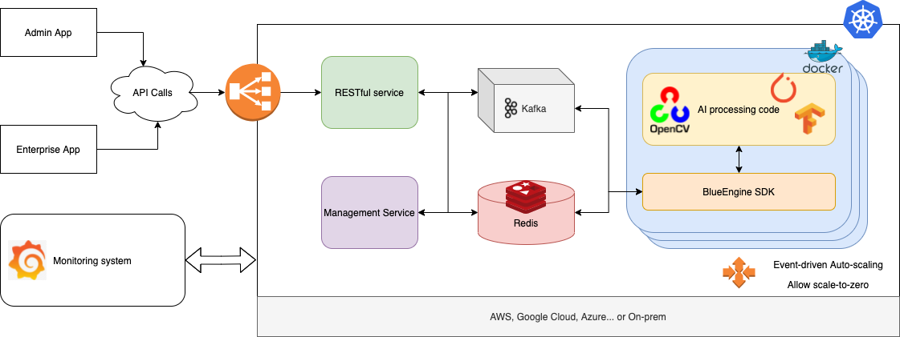
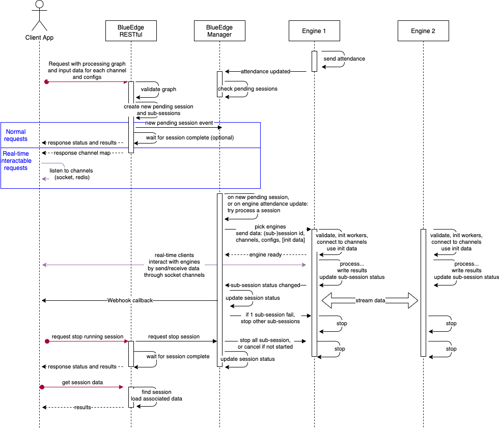

# BlueEdge architecture overview

The BlueEdge system is designed with the following requirements in mind:

- Be able to create Directed Acyclic Graphs (DAGs) of multiple engines to process data with complicated workflows.
- Be able to transfer and process real-time, high throughput streaming data of various formats, including *JSON*, *image*, *video* or *file*.
- Scales engine replicas and instances based on number of pending requests.
- Scale unused engines down to zero to minimize operation cost of GPU instances.
- Allows users to define webhook callback on events from system and engines.
- Easily deploy on Cloud, On-prem or Hybrid systems.
- Ready-to-use monitoring system for every services and engines.

## Terms

- **Engine**: *Engines* are the processing units of the system. They implement the [BlueEngine SDK](../tutorials/get_started.md) to be able to communicate with other services and engines.
- **Session**: A *Session* is created when an user make a processing request to the system. It contains:
    - The input data from the user, like input file url, initial data, or config...
    - The processing DAG, including participated engines' ID, the data channels, the engines' IO connection to the data channels, and the results channels which data send to them will be stored to the database.
    - The session and sub-session status.
    - Webhook registrations.
- **Sub-session**: Each engine that join to process a *session* is presented by a *sub-session*. For example, if the DAG contains 10 engines, then a session created with that DAG will contains 10 sub-sessions. The sub-sessions can be finished before the session complete. The session is failed if one of the sub-sessions fails, and the remaining sub-sessions will be informed to stop.
- **Engine attendance**: When an engine start, it begin to present itself to the management system by write an *attendance* record to the Redis database, contains informations about the engine's name, ID, status, and whether it is available to handler another session. The *Management service* uses this information to pick engines to process the sessions.

## Architecture

The high-level architecture of the system is illustrated as follow:

The main components are:

- [**RESTful service**](https://github.com/liftupvn/blueedge/tree/master/apps/svc_engine_management_restful): This service is the API gateway. It handles all of the REST API requests from the outside world, validate, and register the `session` to the system.
- [**Management Service**](https://github.com/liftupvn/blueedge/tree/master/apps/svc_engine_management): This service continuously listen to events, scan the sessions and engines, and assign the engines to process the pending events.
- **Kafka** is used to transfer data between engines and services.
- **Redis** is used to store data of sessions, engines' attendance, and processing results.
- **Engines** are the processing unit of the system. Each of them implement the *BlueEngine SDK* to connect the engine's processing functions to the communication system, enable them to process the incoming sessions.
- The system is deployed on Kubernetes, which allow deploy on any cloud provider.
- [KEDA](https://keda.sh/) was integrated in order to allow auto scaling based on number of pending requests.

## Flow

The basic flow of the system is illustrated on the above image:

- When the engines start, they start informing the *Management service* about their presents by writing `Attendances` and send "ping" messages.
- When an user make a request to the *RESTful service*, the service validates and records a `Session` to the system, and inform the *Management service* about the new request. It can return the `sessionId` immediately, or try to wait for the session to complete and response with the results. This is helpful for requests that should be processed in just a few seconds.
- When the *Management service* receives either "New request" or "Engine Attendance" message, it will scan the database to see if there are any pending sessions. Then it will smartly pick the engines based on their status. 
- If required engines are picked, the *Management service* will try to start processing the session by send the appropriated *Start* messages to the engines.
- The engines validate and prepare for the incoming session, and send *Engine Ready* message back to the *Management service*.
- If all of the engines are ready, the *Management service* will send the session's input data to the data channels that are connected to the engines.
- The engine receive the data from input channels, write the results to output data channels, which can be sent to other engines, or be saved to the database for later use by the user.
- The user can make *stop* request to cancel pending sessions, or stop running sessions.
- The user can make requests to get the results or check status, by using the `sessionId`.
- If the sessions contains Webhook registrations, based on events' `type` from engines' *Status* channel, callbacks will be made.
- During processing a session, the engines periodically update a `heartbeat` record in the database. The manager continously scan the database for `heartbeat` records, and if a `heartbeat` is outdated, this means an engine that process the session was "dead", and the session is `failed`!

## Scaling mechanism

- The **RESTful service** and **Management service** is auto-scaled by CPU and RAM usage.
- The engines are auto scaled by the number of pending sessions in the system that require them to process. For example, there are 10 pending sessions in the system and all of them require *engine A*. In the Kubernetes deployment file, engine A was configured it can handle 3 concurent sessions, so the system start spawning engines instances so that there are at least 4 engines online to handle all of the pending sessions.
