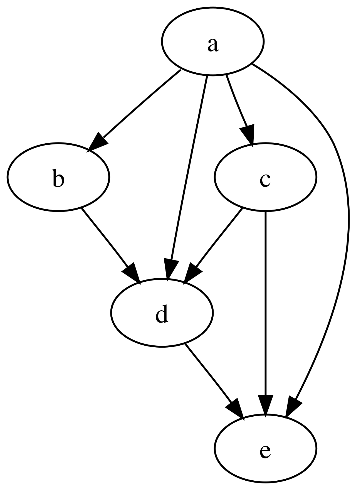
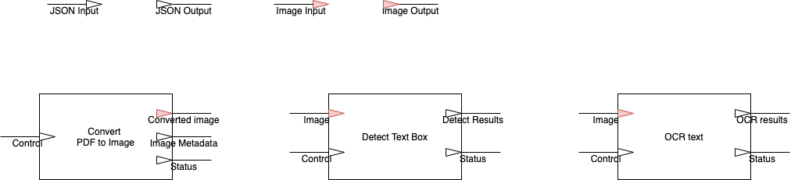
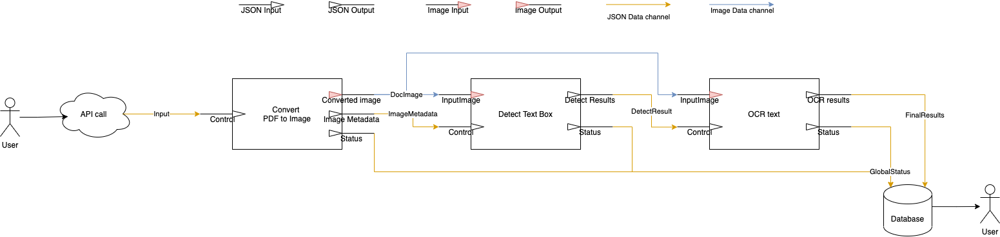

# Request processing with multi-engine DAG

If all you need is just one engine to process everything, use [single engine API](single_api.md). If your application requires multiple engines working together in a Directed Acyclic Graph, what you need is the API `api/v1/process-workflow`.

## Design the DAG

**DAG**, which stands for *Directed Acyclic Graph*, is a graph that presents the connections and data flow between engines. Below is a DAG (source: https://en.wikipedia.org/wiki/Directed_acyclic_graph)



To set up a DAG that uses the BlueEngines, we need to define:

- The engines that will receive input data or data from other engines.
- The data channels between engines, which the engines' channels will connect to. Each data channel has a unique name and a specified data type. 

> By separating the data channel definitions with the engines, the engines don't have to know exactly which engines they are sending data to or receiving data from.

Let's take a look at an example, where we define an OCR processing pipeline that extract text from scanned PDF files. 

### Define the processing engines

The process contains the following steps:

- Download the PDF file from the user-provided URL.
- Convert the PDF pages to images.
- Pre-process the image.
- Detect the text boxes in the image.
- Mid-process the boxes: merge boxes to lines, remove small boxes.
- Extract text in the boxes (OCR).
- Post-process: correct, merge into paragraphs.
- Write outputs to database.

The above steps can be devided into 3 engines:

- Engine 1: Receives the PDF file, converts and runs image pre-processing.
- Engine 2: Receives the processed images, detect text boxes and run mid-process.
- Engine 3: Receives the processed images and the detected text boxes, run OCR and post-processing.



### Define the data channels

To define the data channels, we need to understand each engines' input and output channels, what are the data format and what are the expected data to send and receive.

- Engine 1 receives the PDF URL and other user's input data from `Control` channel. It's output the image to the `Converted Image` channel, the images' metadata to the `Image Metadata` channel, and other status to the default `Status` channel.
- Engine 2 receive the processed images from the `InputImage` channel, and the images' metadata and other informations from the first engine through `Control` channel. It sends the detected boxes, metadata, and other info to the `Detect Results` channel, and other status to the `Status` channel.
- Engine 3 also receive the processed images from the `InputImage` channel just like Engine 2, and receive the output from Engine 2's `Detect Results` channel with the `Control` channel. Output to the `OCR Results` are OCR text, which will be received by the user. Status are sent to the `Status` channel.

Try drawing the graph down on a paper, like the following:



We have the following data channels:

- `Input` (type `JSON`) channel feeds the user's input data, including the PDF file URL.
- `DocImage` (type `Image`) transfers the processed images from the `Convert Engine` to the other engines.
- `ImageMetadata` (type `JSON`) transfers the image metadata to the `Detect Engine`. The `Detect Engine` also forwards those data to the `OCR Engine` along with the detection results.
- `DetectResult` (type `JSON`) transfers the text box detections from the `Detect Engine` to the `OCR Engine`, along with the metadata.
- `FinalResults` (type `JSON`) takes the outputs from the `OCR engine` and is configured to store the data to the database.
- `GlobalStatus` (type `JSON`) receives the status from all engines and save to the database.

> The `FinalResults` and `GlobalStatus` is configured so that any data written to them will be stored to the database. Other channels' data will be temporally stored in the communication system and will be wiped out after a short time.

### Calling the API

After designing the processing DAG, it's time to make a call the API to spawn it by calling this API

```json
POST 'http://192.168.80.186:5000/api/v1/process-workflow'

Body:
{
  "dataChannels": [
    {
      "name": "Input",
      "type": "JSON"
    },
    {
      "name": "DocImage",
      "type": "Image"
    },
    {
      "name": "ImageMetadata",
      "type": "JSON"
    },
    {
      "name": "DetectResult",
      "type": "JSON"
    },
    {
      "name": "FinalResults",
      "type": "JSON",
      "interested": true
    },
    {
      "name": "GlobalStatus",
      "type": "JSON",
      "interested": true
    }
  ],
  "engines": [
    {
      "id": "ghr0zmw8Is_Uc0a-jSHYO",
      "name": "pdf convert engine",
      "inputs": [
        {
          "name": "Control",
          "type": "JSON",
          "linkTo": "Input"
        }
      ],
      "outputs": [
        {
          "name": "ConvertedImage",
          "type": "Image",
          "linkTo": "DocImage"
        },
        {
          "name": "ImageMetadata",
          "type": "JSON",
          "linkTo": "ImageMetadata"
        },
        {
          "name": "Status",
          "type": "JSON",
          "linkTo": "GlobalStatus"
        }
      ]
    },
    {
      "id": "MdYfj8cYI9-nX4eSVWTDN",
      "name": "detect text engine",
      "inputs": [
        {
          "name": "Control",
          "type": "JSON",
          "linkTo": "ImageMetadata"
        },
        {
          "name": "InputImage",
          "type": "Image",
          "linkTo": "DocImage"
        }
      ],
      "outputs": [
        {
          "name": "DetectResults",
          "type": "JSON",
          "linkTo": "DetectResult"
        },
        {
          "name": "Status",
          "type": "JSON",
          "linkTo": "GlobalStatus"
        }
      ]
    },
    {
      "id": "EEK4xUaCHkqibpvjBsPxj",
      "name": "OCR engine",
      "inputs": [
        {
          "name": "Control",
          "type": "JSON",
          "linkTo": "DetectResult"
        },
        {
          "name": "InputImage",
          "type": "Image",
          "linkTo": "DocImage"
        }
      ],
      "outputs": [
        {
          "name": "OCRResults",
          "type": "JSON",
          "linkTo": "FinalResults"
        },
        {
          "name": "Status",
          "type": "JSON",
          "linkTo": "GlobalStatus"
        }
      ]
    }
  ],
  "startData": [
    {
      "channelName": "Input",
      "payload": {
        "fileUrl": "http://foo.com/bar.pdf"
      }
    }
  ],
  "webhooks": [
    {
      "statusTypes": ["finish", "sessionStatusChanged"],
      "callbackUrl": "",
      "callbackHeader": {},
      "resultChan": "Result"
    }
  ],
  "waitTimeSecond": 0
}
```

The `dataChannels` list defines the data channels, each including:

- `name` of the channel (required)
- `type` of the channel (required)
- `interested` if set to true, the output will be stored in the database (optional)

The `engines` list define the engines, each including:

- `id` of the engine, must match the engine's config (required).
- `name` of the engine (optional).
- `inputs` and `outputs` list define the IO channels of the engines, and how they are connected to the graph's data channels:
    - `name` of the IO channel
    - `type` of the IO channel, must be the same as the connected data channel.
    - `linkTo` is the name of the data channel that this IO channel should be listen to or send data to.

The `startData` list provide the user's input data that will be sent to the desired channels.

- `channelName` is the data channel name.
- `payload` is the data to be sent to the channel. Follow the format of the engine.

The `webhooks` list defines how the callbacks request should be made. See (Webhook doc)[tutorials/webhook.md]

The `rank` value is used to prioritize the session. Sessions with higher rank value will be processed first. Default is 0.

For processes that should be processed in a short time (a few seconds), you can set the `waitTimeSecond` value, which will tell the API to block and wait for the session to be finished for maximum that value, and response as soon as the session finish, or the time has been reached. Default is 0, which mean the API will response immediately.

Response from API:

```json
{
    "status": "success",
    "message": "",
    "data": {
        "sessionId": "session-process-workflow-0-1636105719.5759473-vv6gz93fyL96uvcOUkCxt",
        "process": {
            "status": "pending",
            "current_position": 0,
            "total_pending": 1,
            "total_queuing": 0
        },
        "results": {}
    }
}
```

Use the provided `sessionId` to later receive the results. 